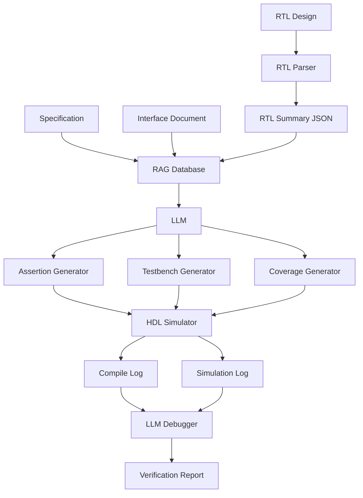

<div align="center">

# 🤖 AI-Assisted RTL Verification Framework using LLMs

### End-to-End AI Pipeline for Digital ASIC Verification


An AI-powered verification assistant that combines **Large Language Models (LLMs)**, **Retrieval-Augmented Generation (RAG)**, **RTL Parsing**, and **SystemVerilog code generation** to automate RTL verification tasks.

</div>

---

# 📚 Table of Contents

- [Overview](#overview)
- [Features](#features)
- [Architecture](#architecture)
- [Project Workflow](#project-workflow)
- [Project Structure](#project-structure)
- [Technologies Used](#technologies-used)
- [Installation](#installation)
- [Usage](#usage)
- [Example Workflow](#example-workflow)
- [Future Work](#future-work)
- [Research Motivation](#research-motivation)
- [Author](#author)

---

# Overview

Digital ASIC verification is one of the most time-consuming stages of chip development.

This project investigates how **Large Language Models (LLMs)** can automate verification tasks including:

- RTL understanding
- RTL documentation
- RTL parsing
- Retrieval-Augmented Generation (RAG)
- SystemVerilog Assertion generation
- Testbench generation
- Functional coverage generation
- Simulation log debugging

The goal is to build an **AI Verification Assistant** capable of assisting verification engineers throughout the RTL verification flow.

---

# Features

| Project | Description | Status |
|----------|-------------|--------|
| 💬 Chat with Verilog | Ask questions about RTL using natural language | ✅ |
| 📝 RTL Summarizer | Generate RTL documentation automatically | ✅ |
| 🔍 RTL Parser | Extract RTL information into JSON using PyVerilog | ✅ |
| 📚 RAG | Store specifications and RTL in a vector database | ✅ |
| ✅ Assertion Generator | Generate SystemVerilog Assertions | ✅ |
| 🧪 Testbench Generator | Generate SystemVerilog testbench skeletons | ✅ |
| 📊 Coverage Generator | Generate functional coverage | ✅ |
| 🐞 LLM Verification Debugger | Analyze compile and simulation logs | ✅ |

---

# Architecture



---

# Project Workflow

```text
RTL Design
Specification
Interface Documentation
        │
        ▼
   RTL Parsing
        │
        ▼
 RTL Summary (JSON)
        │
        ▼
      RAG
 (FAISS / ChromaDB)
        │
        ▼
 Large Language Model
        │
 ┌──────┼─────────┐
 ▼      ▼         ▼
SVA     TB     Coverage
        │
        ▼
HDL Simulation
        │
        ▼
Compile / Simulation Logs
        │
        ▼
LLM Debugger
        │
        ▼
Verification Report
```

---

# Completed Projects

## 1️⃣ Chat with Verilog

Query RTL using natural language.

Example

> How many inputs does this module have?

---

## 2️⃣ RTL Summarizer

Automatically generates RTL documentation.

Example output

- Module Description
- Inputs
- Outputs
- Registers
- Functional Behavior

---

## 3️⃣ RTL Parser

Uses **PyVerilog** to extract RTL information.

Example

```json
{
    "module": "counter",
    "inputs": [
        "clk",
        "rst"
    ],
    "outputs": [
        "count"
    ],
    "registers": [
        "count"
    ],
    "always_blocks": 1
}
```

---

## 4️⃣ Retrieval-Augmented Generation (RAG)

Stores

- Design Specification
- Interface Documentation
- RTL Summary

inside a vector database.

Supports

- Semantic search
- Context retrieval
- Accurate LLM responses

---

## 5️⃣ Assertion Generation

Input

- RTL Summary
- Specification

Output

```systemverilog
property p_reset;

@(posedge clk)

rst |-> (count == 0);

endproperty

assert property(p_reset);
```

---

## 6️⃣ Testbench Generation

Automatically generates

- DUT instantiation
- Clock generation
- Reset generation
- Stimulus template

---

## 7️⃣ Coverage Generation

Automatically generates

- Covergroups
- Coverpoints
- Cross Coverage

---

## 8️⃣ LLM Verification Debugger

Analyzes

- compile.log
- simulation.log
- assertion failures

Provides

- Root cause analysis
- Suggested fixes
- Verification recommendations

---

# Project Structure

```text
AI-Verification-Assistant
│
├── documents
│   ├── spec.txt
│   ├── interface.txt
│   └── rtl_summary.json
│
├── rtl
│   └── counter.v
│
├── parser
│   └── rtl_parser.py
│
├── rag
│   ├── build_vector_db.py
│   └── retrieve.py
│
├── generators
│   ├── assertion_generator.py
│   ├── testbench_generator.py
│   └── coverage_generator.py
│
├── debugger
│   └── log_debugger.py
│
├── outputs
│   ├── assertions.sv
│   ├── counter_tb.sv
│   ├── coverage.sv
│   ├── compile.log
│   ├── simulation.log
│   └── verification_report.md
│
├── notebooks
│   └── project.ipynb
│
├── requirements.txt
│
└── README.md
```

---

# Technologies Used

| Category | Technologies |
|-----------|--------------|
| Programming | Python |
| HDL | Verilog, SystemVerilog |
| RTL Parsing | PyVerilog |
| LLM | Mistral-7B-Instruct |
| Embeddings | sentence-transformers |
| Vector Database | FAISS / ChromaDB |
| AI Framework | LangChain |
| Simulation | QuestaSim / ModelSim |
| Notebook | Kaggle |

---

# Installation

Clone the repository

```bash
git clone https://github.com/YOUR_USERNAME/AI-Verification-Assistant.git

cd AI-Verification-Assistant
```

Install dependencies

```bash
pip install -r requirements.txt
```

---

# Usage

## Parse RTL

```bash
python parser/rtl_parser.py
```

---

## Build Vector Database

```bash
python rag/build_vector_db.py
```

---

## Generate Assertions

```bash
python generators/assertion_generator.py
```

---

## Generate Testbench

```bash
python generators/testbench_generator.py
```

---

## Generate Coverage

```bash
python generators/coverage_generator.py
```

---

## Analyze Simulation Logs

```bash
python debugger/log_debugger.py
```

---

# Example Workflow

```text
User
 │
 ▼
Upload RTL
 │
 ▼
RTL Parser
 │
 ▼
Generate RTL JSON
 │
 ▼
Store in FAISS
 │
 ▼
Retrieve Context
 │
 ▼
LLM
 │
 ├── Assertions
 ├── Testbench
 ├── Coverage
 │
 ▼
Simulation
 │
 ▼
Compile Log
Simulation Log
 │
 ▼
LLM Debugger
 │
 ▼
Verification Report
```

---

# Future Work

- Multi-Agent Verification Framework
- Automatic QuestaSim execution
- RISC-V Verification Assistant
- UVM Testbench Generation
- Waveform Analysis
- Automatic Assertion Repair
- Coverage Closure Assistant
- CI/CD Integration
- Verification Dashboard

---

# Research Motivation

The objective of this project is to explore how Large Language Models can improve RTL verification by automating repetitive engineering tasks while assisting verification engineers with debugging, documentation, and verification planning.

This work serves as a foundation for future research on AI-assisted semiconductor verification and intelligent verification assistants.

---

# Author

**Maha Saad elashmawi**


Research Interests

- AI for ASIC Design
- RTL Verification
- Large Language Models
- Retrieval-Augmented Generation
- Digital IC Design

---

## ⭐ If you found this project useful, please consider giving it a Star!
